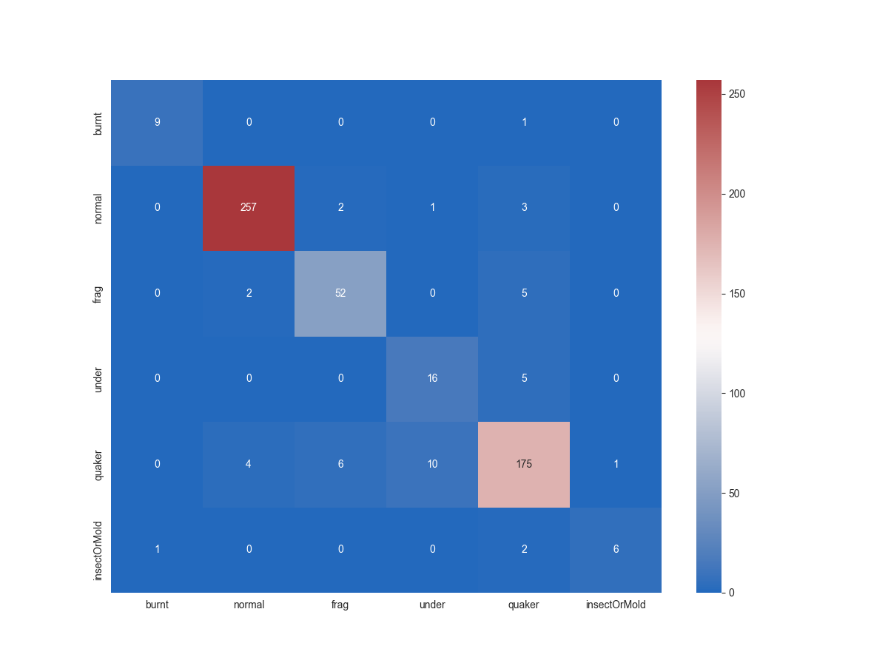
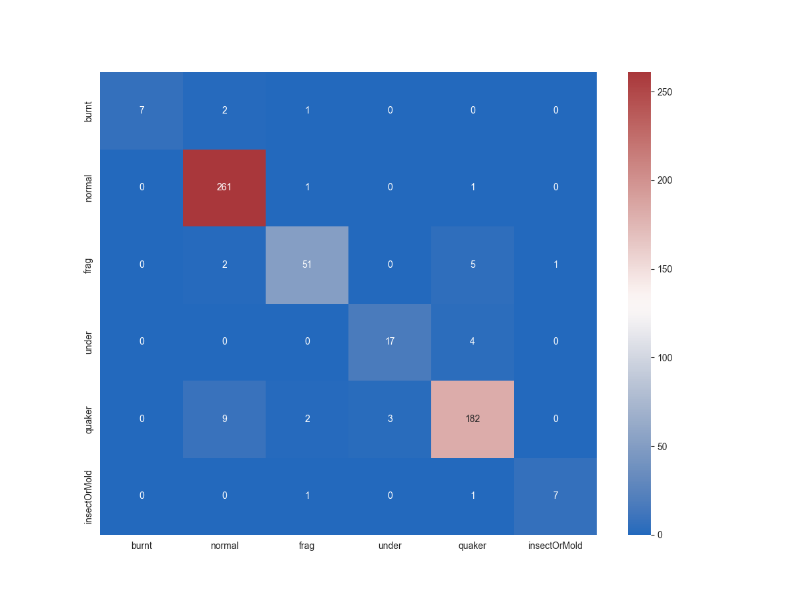
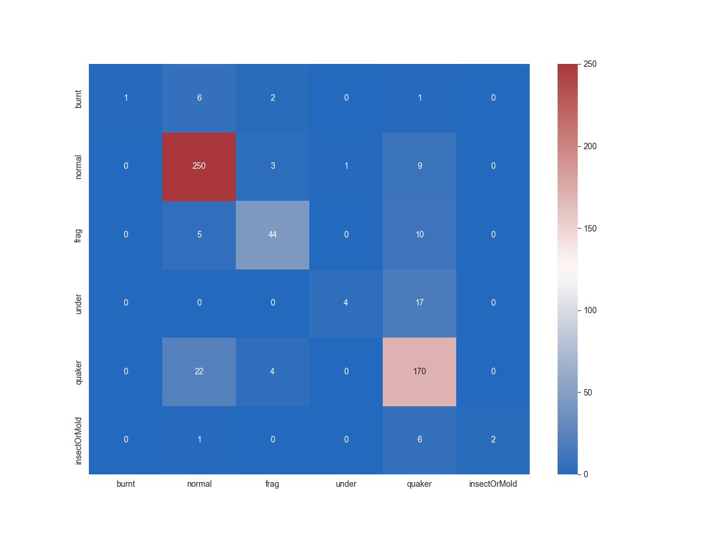

# This document contains a record of all the models trained during the project. 

| Architecture                                                  | Training time     | Accuracy | Confusion matrix                                             | Batch size | learning rate | momentum | Gamma (scheduler) | Step size(scheduler) |
|---------------------------------------------------------------|-------------------|----------|--------------------------------------------------------------|------------|---------------|----------|-------------------|----------------------|
| ResNet 18                                                     | 18 minutes        | 93.0%    |                  | 16         | 0.001         | 0.9      | 0.1               | 10                   |
| ResNet 34                                                     | 34 minutes        | 93.6%    |                  | 16         | 0.001         | 0.9      | 0.1               | 8                    |
| EfficientNet V2 (small)                                       | 42 minutes        | 90.5%    |          | 16         | 0.001         | 0.9      | 0.1               | 8                    |
| ResNet 34 (with improved background removal)                  | 28 minutes        | 93.4     |          | 16         | 0.001         | 0.9      | 0.1               | 8                    |
| ResNet 18 (with improved background removal)                  | 22 minutes        | 91.9%    |          | 16         | 0.001         | 0.9      | 0.1               | 10                   |
| ResnNet 34 (improved background, smaller batches)             | 29 minutes        | 94.1%    |  | 8          | 0.001         | 0.9      | 0.1               | 10                   |
| ResnNet 34 (improved background, even smaller batches)        | 31 minutes        | 93.7%    |  | 4          | 0.001         | 0.9      | 0.1               | 10                   |
| Swin transformer (base, all but last layer frozen, 40 epochs) | 1 hour 50 minutes | 85.4%    |             | 4          | 0.001         | 0.9      | 0.1               | 10                   |

## Note: weights files not tracked but available on request